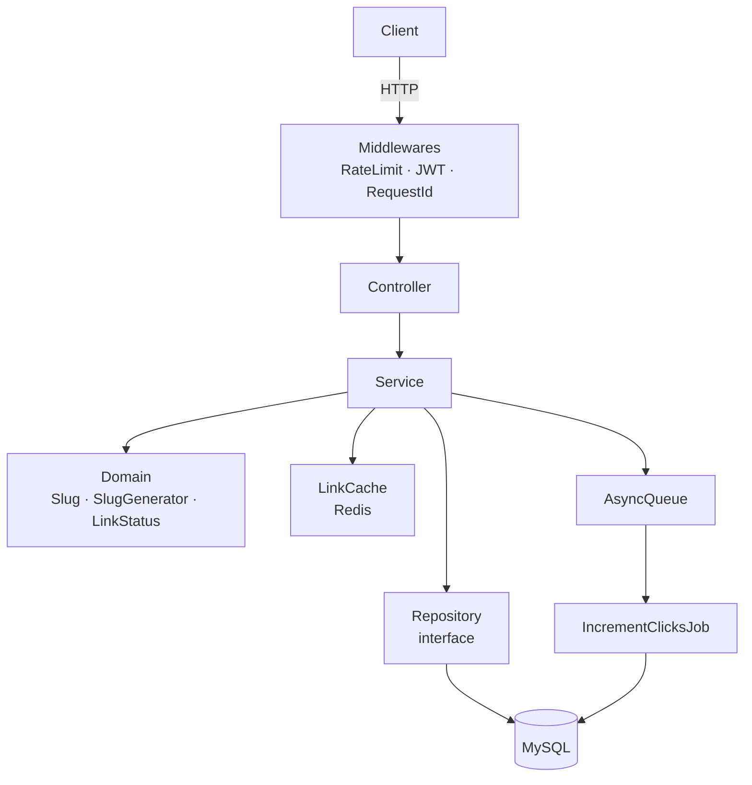

# hyperf-url-shortner

Encurtador de URLs construído com **Hyperf 3.x + Swoole** como projeto de estudo orientado à vaga de PHP Pleno. O domínio é simples por design — o foco está no framework, nas ferramentas e nas práticas de engenharia que uma fintech exige.

---

## Stack

| Tecnologia       | Papel                                                                         |
|------------------|-------------------------------------------------------------------------------|
| PHP 8.4          | Runtime — uso extensivo de `readonly`, `enum`, `match`, constructor promotion |
| Swoole 5.x       | Servidor HTTP assíncrono, long-running process, coroutines                    |
| Hyperf 3.x       | Framework — DI, AOP, Connection Pool, AsyncQueue                              |
| MySQL 8          | Persistência — migrations, UUID como PK, índices explícitos                   |
| Redis            | Cache-aside (redirect) + Rate limiting (Sorted Set sliding window)            |
| PHPUnit          | Testes unitários e de feature                                                 |
| Docker Compose   | Ambiente reprodutível com `app`, `mysql`, `redis`, `kafka`                    |
| firebase/php-jwt | Autenticação JWT (HS256/RS256)                                                |

---

## Práticas de engenharia

### TDD
Testes escritos **antes** da implementação, ciclo red → green → refactor. A suíte cobre:
- **Testes unitários** — domínio puro em isolamento, sem framework, sem banco
- **Testes de feature** — endpoints reais via `HttpTestCase`, banco de teste

```
tests/
├── Unit/
│   └── Domain/Link/     # SlugTest, LinkStatusTest
└── Feature/
    └── Link/            # CreateLinkTest, RedirectTest, StatsTest
```

### DDD lite
O domínio vive em `app/Domain/` e **não importa nada do Hyperf**. Value Objects, interfaces e enums são PHP puro — testáveis e portáveis:

```
app/Domain/Link/
├── Slug.php              # Value Object — readonly, imutável, valida formato
├── SlugGenerator.php     # interface
├── RandomSlugGenerator.php
├── LinkRepository.php    # interface — implementação fica em Infrastructure/
└── LinkStatus.php        # enum: ACTIVE | EXPIRED | DISABLED
```

### Clean Code / SOLID
- **Controller fino**: lê input, chama Service, monta response — zero lógica de negócio
- **Service fino**: delega decisões ao Domain e persistência ao Repository
- **Exceções tipadas**: `SlugAlreadyExistsException` capturada por ExceptionHandler, retorna 409
- **Estado por request via `Context`**: Hyperf é long-running — nenhum estado em singleton
- **Sem over-engineering**: sem CQRS, sem Event Sourcing, sem abstrações que o domínio não justifica

### Conventional Commits
```
feat(link): implementa endpoint POST /urls
test(link): adiciona testes TDD para criação de links
fix(slug): corrige colisão em slugs gerados automaticamente
refactor(cache): extrai LinkCache para camada dedicada
perf(ratelimit): converte para script Lua atômico
chore(docker): adiciona healthcheck no mysql
```

---

## Arquitetura



### Fluxo do redirect (endpoint quente)

```
GET /{slug}
  → RateLimitMiddleware (Redis ZSet sliding window)
  → LinkService::resolve()
      → Redis HIT  → 302 redirect (enfileira IncrementClicksJob)
      → Redis MISS → MySQL → popula Redis → 302 redirect
                   → não encontrado → 404
                   → status != ACTIVE / expirado → 410
```

---

## Endpoints

| Método | Rota | Auth | Descrição |
|--------|------|------|-----------|
| `POST` | `/urls` | JWT | Cria link encurtado |
| `GET` | `/{slug}` | — | Redireciona para a URL original |
| `GET` | `/urls/{slug}/stats` | — | Estatísticas de acesso |

### POST /urls

```bash
curl -X POST http://localhost:9501/urls \
  -H "Authorization: Bearer <token>" \
  -H "Content-Type: application/json" \
  -d '{"url": "https://example.com", "slug": "meuslug"}'
```

```json
// 201 Created
{
  "slug": "meuslug",
  "short_url": "http://localhost:9501/meuslug",
  "original_url": "https://example.com"
}
```

| Status | Motivo |
|--------|--------|
| `201` | Link criado |
| `400` | URL inválida |
| `401` | Token ausente ou inválido |
| `409` | Slug já existe |
| `429` | Rate limit excedido |

### GET /urls/{slug}/stats

```json
// 200 OK
{
  "slug": "meuslug",
  "clicks": 42,
  "status": "ACTIVE",
  "created_at": "2026-04-01T10:00:00Z",
  "expires_at": null
}
```

---

## Decisões de design

| Decisão | Por quê |
|---------|---------|
| UUID como PK | Gerado no app, facilita idempotência e não expõe sequência de IDs |
| Redirect 302, não 301 | 301 é cacheado para sempre pelo browser — impossível invalidar |
| Cache-aside explícito (não `Cache::remember`) | Treinar o padrão consciente; deixa claro quando invalidar |
| Sliding window com Redis ZSet, não fixed window | Fixed window permite burst na virada do minuto; sliding window não |
| UPDATE atômico no contador (`SET clicks = clicks + 1`) | Evita race condition do load-modify-save em alta concorrência |
| AsyncQueue para incremento de cliques | Redirect retorna 302 imediatamente; contador sobe sem bloquear o endpoint |
| `alg: none` rejeitado explicitamente no JwtMiddleware | Vulnerabilidade clássica — libs antigas aceitavam; verificação explícita fecha a brecha |

---

## Como rodar

```bash
# 1. Sobe os containers
docker compose up -d

# 2. Instala dependências
docker compose exec app composer install

# 3. Copia o .env
cp .env.example .env

# 4. Roda as migrations
docker compose exec app php bin/hyperf.php migrate

# 5. Inicia o worker de filas (terminal separado)
docker compose exec app php bin/hyperf.php queue:work

# 6. Gera um token JWT para teste
docker compose exec app php bin/hyperf.php token:issue <user_id>

# 7. Executa os testes
docker compose exec app composer test
```

---

## Estrutura do projeto

```
app/
├── Controller/
│   └── LinkController.php
├── Domain/
│   └── Link/
│       ├── Slug.php
│       ├── SlugGenerator.php
│       ├── RandomSlugGenerator.php
│       ├── LinkRepository.php
│       └── LinkStatus.php
├── Exception/
│   ├── SlugAlreadyExistsException.php
│   └── Handler/
│       └── SlugAlreadyExistsHandler.php
├── Infrastructure/
│   └── Link/
│       └── EloquentLinkRepository.php
├── Job/
│   └── IncrementClicksJob.php
├── Middleware/
│   ├── JwtMiddleware.php
│   ├── RateLimitMiddleware.php
│   └── RequestIdMiddleware.php
├── Model/
│   └── Link.php
└── Service/
    ├── LinkService.php
    └── LinkCache.php
config/
├── autoload/
│   ├── databases.php
│   ├── redis.php
│   ├── exceptions.php
│   └── jwt.php
└── routes.php
migrations/
tests/
├── Unit/Domain/Link/
└── Feature/Link/
```

---

## Roadmap

| # | Task | Status |
|---|------|--------|
| 01 | Setup inicial com Docker Compose | ✅ |
| 02 | Domínio puro: `Slug` + `SlugGenerator` (TDD) | ✅ |
| 03 | Model + migration + Repository | ✅ |
| 04 | Endpoint `POST /urls` (TDD) | 🚧 |
| 05 | Endpoint `GET /{slug}` com cache Redis | ⬜ |
| 06 | Contador assíncrono via AsyncQueue | ⬜ |
| 07 | Endpoint `GET /urls/{slug}/stats` | ⬜ |
| 08 | Rate limiting por IP com Redis ZSet | ⬜ |
| 09 | JWT middleware | ⬜ |
| 10 | README definitivo + diagrama | ⬜ |

---

## Melhorias futuras

- **Cache stampede**: implementar single-flight lock ou probabilistic early expiration
- **Serialização Redis**: avaliar MessagePack ou igbinary vs JSON para menos bytes
- **Rate limit via Lua script**: operação atômica, menos round-trips ao Redis
- **CI/CD**: GitHub Actions com `composer test` + PHPStan

---

## Licença

MIT
